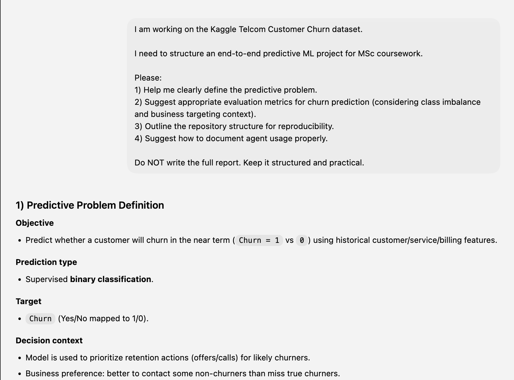
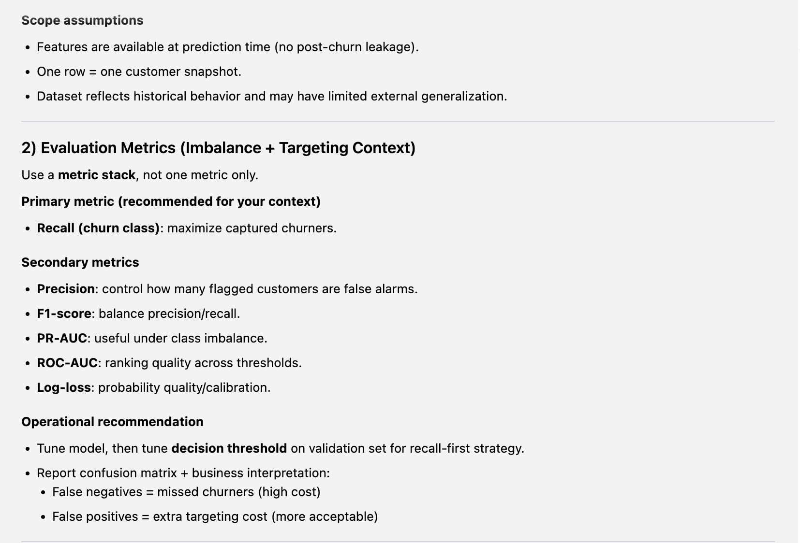
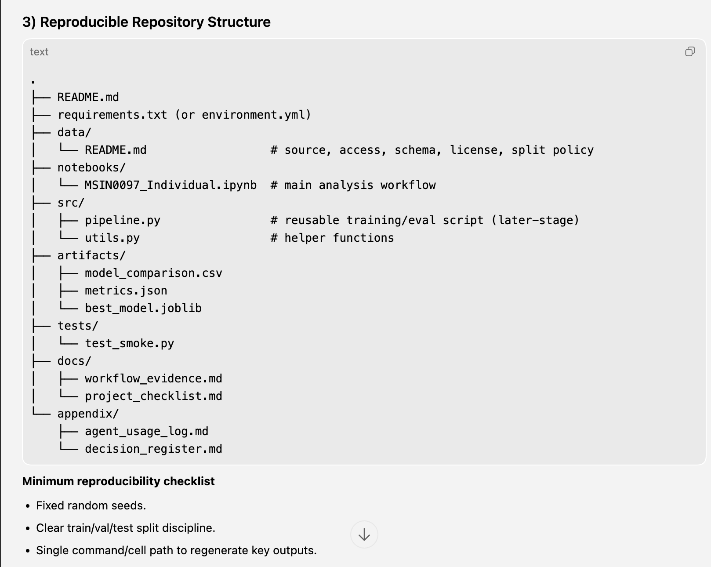
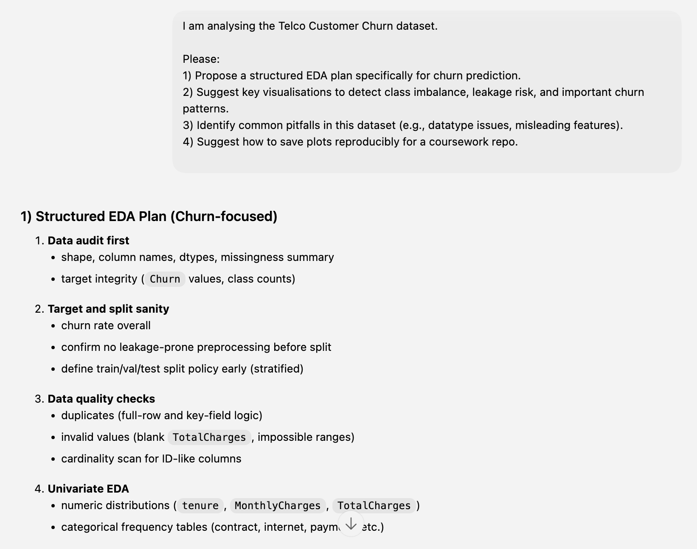
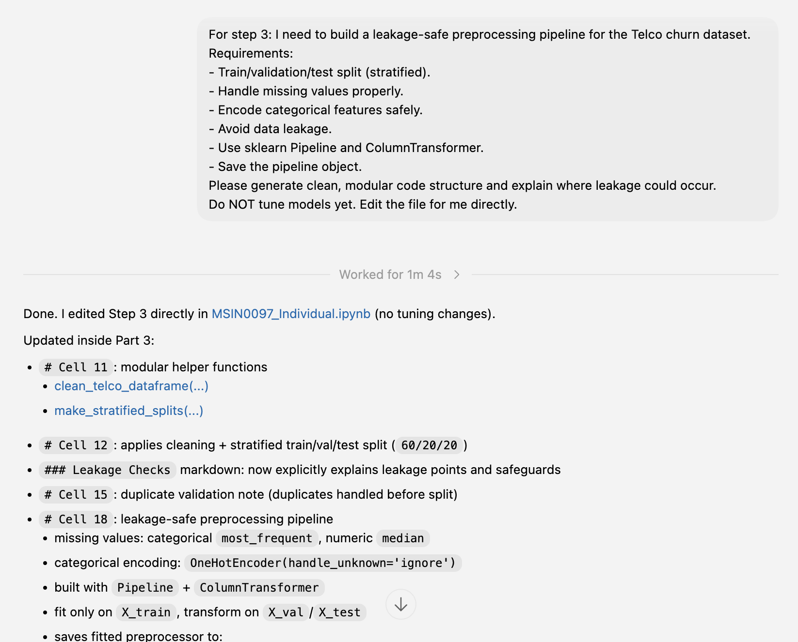
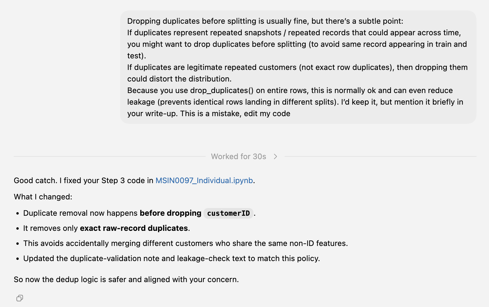
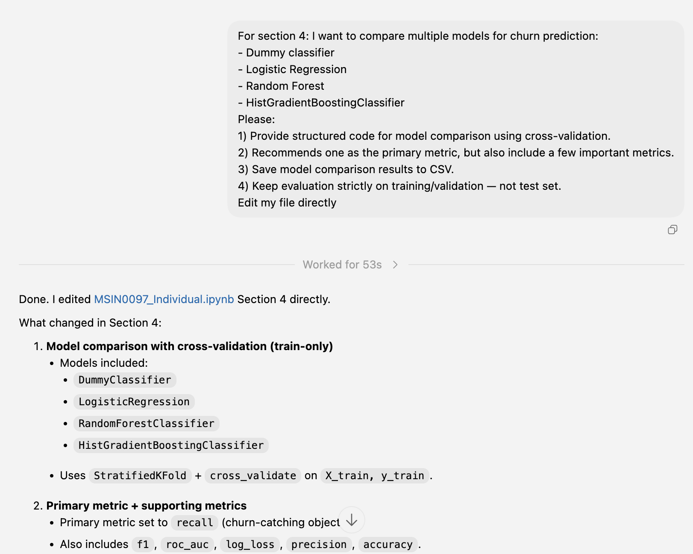
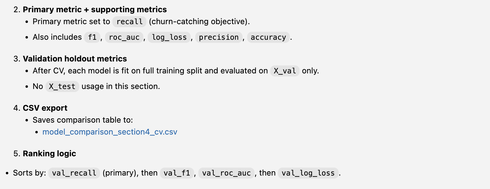
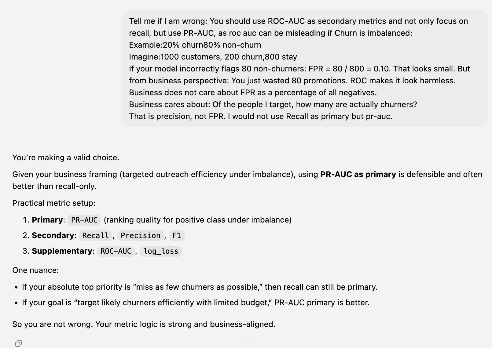
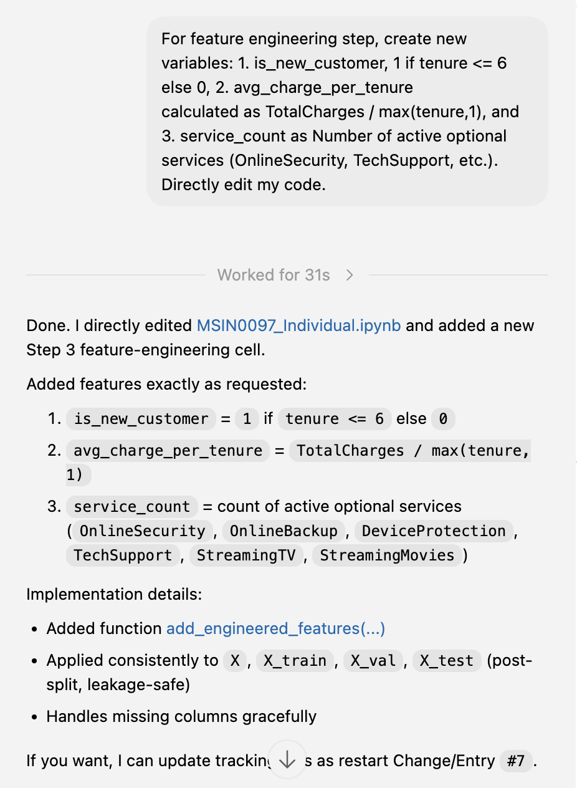

# Appendix A: Agent Usage Log

This appendix records meaningful agent interactions that materially affected the project.

## Logging Standard

For each entry include:
- date/time,
- task requested,
- key prompt/interaction summary,
- output produced by agent,
- your verification action,
- outcome and impact.

## Entries

### Entry 001

- Date: `2026-02-22`
- Task: Reframe project start with practical coursework-aligned structure
- Interaction summary: Requested structured guidance for predictive problem definition, evaluation metrics for churn under imbalance/business targeting, reproducible repository structure, and proper agent-usage documentation.
- Agent output: Provided a six-step practical framework aligned to the brief, including recall-first metric strategy with supporting metrics, reproducibility-oriented repo layout, and clear agent log/decision register documentation approach.
- Verification performed: Reviewed alignment against assignment requirements and accepted as restart baseline.
- Outcome: Accepted.
- Impact: Reset project execution on a cleaner, rubric-aligned foundation before continuing implementation.
- Evidence:

### Entry 002

- Date: `2026-02-22`
- Task: Implement missing EDA elements and reproducible plot export directly in notebook
- Interaction summary: Requested direct notebook edits for a churn-focused EDA plan implementation, key visuals for class imbalance/leakage/patterns, common pitfall notes, and reproducible figure saving.
- Agent output: Updated `MSIN0097_Individual.ipynb` with:
  - class-imbalance visual with counts and percentages,
  - additional churn pattern visuals (segment churn rates with support counts),
  - concise Telco pitfall notes,
  - `save_plot()` helper and standardized figure export to `artifacts/figures`.
- Verification performed: Confirmed expected cells and save/export hooks exist in notebook.
- Outcome: Accepted.
- Impact: Made Step 2 outputs reproducible and improved marker-facing clarity of EDA evidence.
- Evidence:

### Entry 003

- Date: `2026-02-22`
- Task: Implement Step 3 leakage-safe preprocessing pipeline directly in notebook
- Interaction summary: Requested Step 3 code in `MSIN0097_Individual.ipynb` (not separate scripts): stratified split, missing-value handling, safe categorical encoding, leakage controls, sklearn `Pipeline` + `ColumnTransformer`, and pipeline object persistence.
- Agent output: Updated Step 3 cells with modular helper functions for cleaning/splitting, train/validation/test stratified split, train-only fitted preprocessing pipeline, transformed split outputs, and saved fitted preprocessor to `artifacts/preprocessing_pipeline.joblib`.
- Verification performed: Confirmed required components exist in notebook (`train_test_split` with stratification, train-only `fit_transform`, val/test `transform`, and saved pipeline path).
- Outcome: Accepted.
- Impact: Established a reproducible, leakage-safe preprocessing foundation before model tuning.
- Evidence: 

### Entry 004

- Date: `2026-02-22`
- Task: Correct duplicate-handling mistake in Step 3 preprocessing
- Interaction summary: User identified a flaw: duplicate removal occurred after dropping `customerID`, which could merge different customers with identical non-ID feature values.
- Agent output: Updated `MSIN0097_Individual.ipynb` Step 3 logic to deduplicate exact raw rows before dropping ID fields; updated duplicate-policy notes and leakage commentary accordingly.
- Verification performed: Confirmed revised cell order and dedup policy text in Step 3 cells.
- Outcome: Corrected and accepted; previous duplicate-order approach rejected.
- Impact: Reduced risk of distribution distortion and improved leakage-safe preprocessing validity.
- Evidence: 

### Entry 005

- Date: `2026-02-22`
- Task: Implement Section 4 model comparison with train-only CV (no test usage)
- Interaction summary: Requested direct notebook edits to compare `DummyClassifier`, `LogisticRegression`, `RandomForestClassifier`, and `HistGradientBoostingClassifier` using cross-validation, primary metric recommendation, and CSV export.
- Agent output: Updated Section 4 cell to run stratified CV on training data, evaluate on validation split, prioritize recall as primary ranking metric with supporting metrics (`f1`, `roc_auc`, `log_loss`, `precision`, `accuracy`), and save results to `artifacts/model_comparison_section4_cv.csv`.
- Verification performed: Confirmed Section 4 code references train/validation only (no `X_test`), includes all requested models/metrics, and writes comparison CSV.
- Outcome: Accepted.
- Impact: Completed Step 4 evidence-based model shortlisting in a reproducible and leakage-safe way.
- Evidence:

### Entry 006

- Date: `2026-02-22`
- Task: Correct Section 4 metric-priority mistake (recall-primary -> PR-AUC-primary)
- Interaction summary: User flagged that recall-only priority was misaligned for imbalanced targeting efficiency; requested PR-AUC as primary with other metrics retained.
- Agent output: Updated Section 4 comparison logic to use PR-AUC as the primary CV/validation ranking metric and kept recall, F1, ROC-AUC, log-loss, precision, and accuracy as supporting metrics.
- Verification performed: Confirmed Section 4 includes PR-AUC in scoring/results and ranking order now starts with `val_pr_auc`.
- Outcome: Corrected and accepted; recall-primary approach rejected for this objective framing.
- Impact: Improved business alignment of shortlist criterion for churn targeting under class imbalance.
- Evidence: 

### Entry 007

- Date: `2026-02-22`
- Task: Add feature engineering variables in Step 3 and preview engineered dataset
- Interaction summary: Requested direct notebook edits to create `is_new_customer`, `avg_charge_per_tenure`, and `service_count`; additionally requested a quick head preview after feature creation.
- Agent output: Added a feature-engineering cell that computes the three variables and applies them consistently to `X`, `X_train`, `X_val`, and `X_test`; appended `X_train.head()` preview.
- Verification performed: Confirmed requested columns and preview statement are present in the Step 3 feature-engineering cell.
- Outcome: Accepted.
- Impact: Expanded predictive signal space and improved auditability of transformed data before model tuning.
- Evidence:

